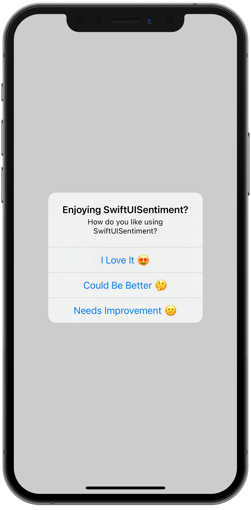
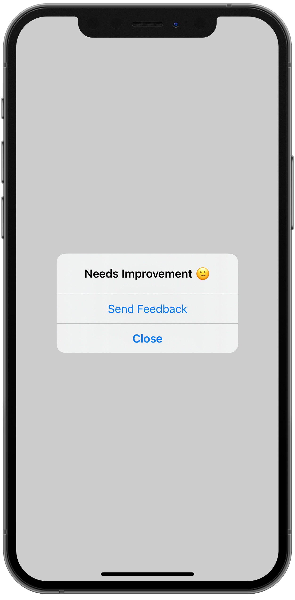

# SwiftUISentiment

[]()
[]()
[](https://lbesson.mit-license.org/)
[](https://github.com/zane-carter/SwiftUISentiment/releases/)
[](https://twitter.com/iamzanecarter)


A simple SwiftUI modifier for collecting user sentiment. SwiftUISentiment works by showing a native alert with options that indicate the users sentiment (usually either positive or negative), which then navigate to a series of configurable option such as submitting a review, sharing on social media, sending an email or redirecting to a URL.

<p>
    
    
    
</p>

## Installation
SwiftUISentiment is a Swift Package so to install it to your project, simply add it as a package dependancy with **File -> Add Packages**.

**`https://github.com/zane-carter/SwiftUISentiment.git`**


## Usage
To use SwiftUISentiment in your project, use the view modifier `sentimentAlert` on any view you'd like to display the sentiment alert on.


### Configuration
When creating a sentiment alert, you must provide a `SentimentAlertConfiguration`. This is where you specify the title, details, what options you would like to present the user. This is usually a few options with varying sentiments, usually positive and negative.

A `SentimentAlertConfiguration` can become quite big so it's best to create your configurations in an extension for code cleanliness. 

```swift
extension SentimentAlertConfiguration {
    static let example = SentimentAlertConfiguration(
        identifier: "SwiftUISentiment",
        title: "Enjoying SwiftUISentiment?",
        details: "How do you like using SwiftUISentiment?",
        options: [
            SentimentAlertOption(label: "I Love It 😍", actions: [
                .review("Write a Review", appId: "1234567"),
                .twitter("Follow on Twitter", handle: "example"),
                .close("Later")
            ]),
            SentimentAlertOption(label: "Could Be Better 🤔", actions: [
                .review("Write a Review", appId: "1234567"),
                .email("Send Feedback", address: "support@example.com"),
                .close("No Thanks")
            ]),
            SentimentAlertOption(label: "Needs Improvement 😕", actions: [
                .email("Send Feedback", address: "support@example.com"),
                .close("Close")
            ])
        ]
    )
}
```


### Manual (Binding)
You can present a sentiment alert using your own SwiftUI Boolean binding. See an example below link to a `Button`.
```swift
struct ContentView: View {
    @State var isPresented = false
    var body: some View {
        Button("Show Alert") {
            self.isPresented.toggle()
        }
        .sentimentAlert(configuration: .example, isPresented: $isPresented)
    }
}
```

### Triggers
If you'd like to present a sentiment alert after a certain amount of views for example, you can use a trigger.

**⚠️ Important ⚠️**

Triggers use `UserDefaults` to track view counts. To reset the count during testing (or between version releases) then you can use the `reset` method on a `SentimentAlertConfiguration`
```swift
let configuration = SentimentAlertConfiguration.example
configuration.reset()
```

**Trigger Once**
```swift
struct ContentView: View {
    var body: some View {
        Text("Trigger Example")
            .sentimentAlert(configuration: .example, trigger: .once())
    }
}
```

**Trigger Once After 3 Views**
```swift
struct ContentView: View {
    var body: some View {
        Text("Trigger Example")
            .sentimentAlert(configuration: .example, trigger: .once(after: 3))
    }
}
```

**Trigger Every 5 Views**
```swift
struct ContentView: View {
    var body: some View {
        Text("Trigger Example")
            .sentimentAlert(configuration: .example, trigger: .repeating(every: 5))
    }
}
```

## Contribution
Contributions are welcome. Just create a PR and add me as a reviewer 😊
